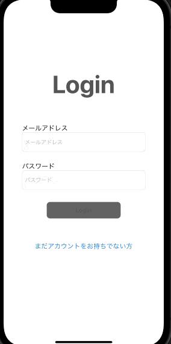

# FreeTalk

## アプリケーション概要

暇な時に、手軽にチャットをすることができるチャットアプリ

Firebaseを使って、アカウントの保存、データを取得する。

## 使用技術
- Xcode Version: 13.0
- Swift Version: 5.5
- データベース: Firebase

## アプリビルド方法
1. clone後、Podfileがあるディレクトリで pod installを行う
```
% pod install
```
2. pod install後、xcworkspaceファイルが作成されるので開く


## 実装機能
- ログイン機能
- ログアウト機能
- プロフィール設定(プロフィール画像、ユーザーID、自己紹介文)
- ユーザーリスト表示機能
- ユーザーリスト絞り込み機能
- ユーザー詳細情報表示機能
- チャットリスト表示機能
- チャットルーム画面、チャット機能

## 利用方法

1. アカウント作成からチャットの開始まで(アカウントを既に作成済みの方は **2** から)
    1. ログイン画面の「アカウントをお持ちでない方」ボタンを押下
    1. アカウント情報を入力、Registerボタンを押下
    1. アカウントの作成が完了すると、プロフィール設定画面が表示されます。(プロフィールはあとで設定可能です。)


    
    // ログイン画面からアカウントの作成、アカウント情報を入力registerボタンを押下して登録するまで
    1.2→ →gif
    
2. アカウントを既に作成済みの場合( **既にログイン済みの場合は起動時チャットリスト画面に遷移します** )
    1. ログイン画面でアカウント情報を入力、Loginボタンを押下

3. ユーザーの追加、チャットの開始まで

    1. TabBar「検索」を押下、ユーザーリストでチャットを開始したいユーザーの追加。

    // ユーザーリスト画面まで表示しユーザー詳細画面を表示し追加
    1→ →gif

    1. TabBar「トーク」を押下、追加されたユーザーを押下するとチャットの開始

    // チャットリスト画面追加されたユーザーとチャットを行う
    4.5→ →gif

4. アカウント設定画面で、アカウント情報の変更を行う
    1. TabBar「設定」を押下、変更したいアカウント情報を入力

    2. 設定ボタンを押下

    // 設定ボタンを押下し、アカウントの設定を行う
    4.5→ →gif

## なぜ、このサービスを作ろうと考えたのか


## 今後追加したい機能など


 
 

