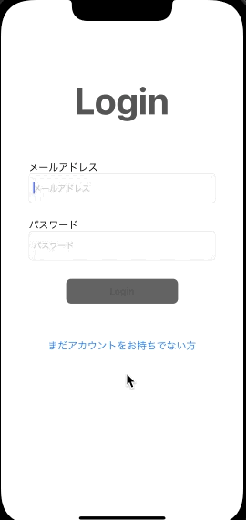
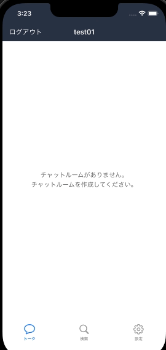

# FreeTalk

## アプリケーション概要

暇な時に、手軽に誰とでもチャットをすることができるiOSアプリ

## 使用技術

- Xcode Version: 13.0
- Swift Version: 5.5
- データベース: Firebase

## アプリビルド方法

1. clone後、Podfileがあるディレクトリで **pod install** を行う
```
% pod install
```
2. pod install後、xcworkspaceファイルが作成されるので開く


## 実装機能

- ログイン機能
- ログアウト機能
- プロフィール設定(プロフィール画像、ユーザーID、自己紹介文)
- ユーザーリスト表示機能
- ユーザーリスト絞り込み機能
- ユーザー詳細情報表示機能
- チャットリスト表示機能
- チャットルーム画面、チャット機能

## 利用方法

1. アカウント作成からチャットの開始まで(アカウントを既に作成済みの方は **2** から)
    1. ログイン画面の「アカウントをお持ちでない方」ボタンを押下

    1. アカウント情報を入力、Registerボタンを押下

    1. アカウントの作成が完了すると、プロフィール設定画面が表示されます(プロフィールはあとで設定可能です)

       
            
2. アカウントを既に作成済みの場合( **既にログイン済みの場合は起動時チャットリスト画面に遷移します** )
    1. ログイン画面でアカウント情報を入力、Loginボタンを押下

3. ユーザーの追加、チャットの開始まで

    1. ユーザーリストでチャットを開始したいユーザーの追加

    1. 追加されたユーザーを押下するとチャットの開始  

       

4. アカウント設定画面で、アカウント情報の変更を行う
    1. 変更したいアカウント情報を入力

    2. 設定ボタンを押下

       

## Demo

      

## なぜ、このサービスを作ろうと考えたのか

   コロナ禍で家にいることが多くなり、人と会う機会が少なくなりました。  
   オンラインで繋がりを増やせないかと考えたときにこのサービスを作ろうと考えました。  
   暇な時に、アカウント作成だけで **手軽に誰と** でもトークができる事を重要視しました。  
    
## 今後追加したい機能など

 - アカウント削除
 - チャットルーム削除
 - 全てのユーザーを表示している為、当分ログインしていない人は表示しない等のフィルター処理
 - 新着メッセージの表示

